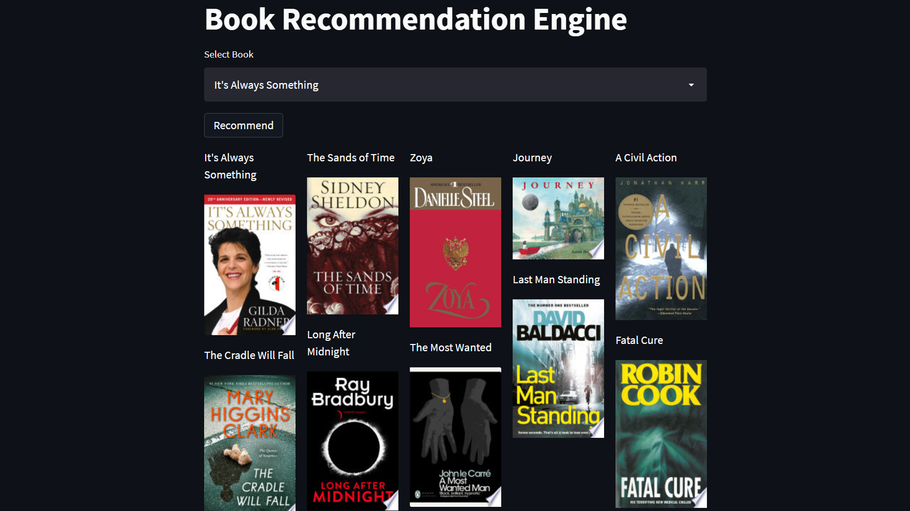

# Book-Recommendation-System

In this project, i tried to make a collaborative based Book recommendation System.

project link :- https://book-recommendation--ai.herokuapp.com/

## Overview

    
## Project Flow

## 1. Data Gathering 
Dataset for this project is gathered from kaggel (https://www.kaggle.com/arashnic/book-recommendation-dataset?select=Books.csv)

## 2. Exploring and cleanning Dataset
In this various step are performed like, \
    - explore the datasets \
    - the unrelated feature are deleted. \
    - clean the choosen feature \
    - Join multiple dataframes \
    - apply different transformations, to make data in right format \
    - create new feature \
    - creating ML model 

## 3. Actually creating the system
so basically in this, for each book some rating was given by users.
from this info a pivot table is created, in which index represent title of 
books, and columns represent users. 
so now for e.g. I  select book "Year of Wonders" based on the rating given by 
user to this book, Ml model will find some books with same response, and this how this Actually works. 

## 4. Deply the system on web
 deploy the application on web with streamlit
